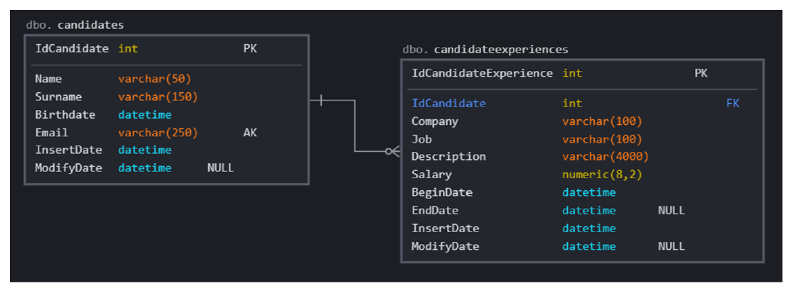

# PandapeChallenge

A recruiter needs to manage a database of candidates for a selection process. 
Using the relational model represented above as a basis, develop a web application using MVC architecture.
that allows the recruiter to carry out the following actions: 

- Consult a list of registered candidates. 
- Register new candidates and their professional experience. 
- Edit the registration of a candidate and his professional experiences. 
- Delete a candidate.

Requirements 

- Uses .Net Core. 
- Use Entity Framework as ORM for queries and data persistence. 
- Develop the application using the relational model shown at the beginning of this document as a base. 
- Develop the entity model using Code-First with Entity Framework. 
- Use SQL in-memory or SQL Express (localdb)
- Don't focus on the Frontend, it's all about the Backend! 

Tips 

- Try to use your knowledge and good practices of OOP, DDD, SOLID and Clean Code. 
- If you have knowledge of the CQRS architectural pattern, use it! 
- Our goal is to know your programming style, there is no right or wrong here. 
- And most of all, have fun!

